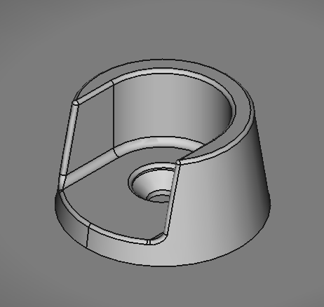
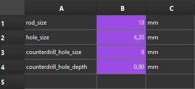

# Closet Rod Holder (Parametric Design)

This rod holder is designed to fit a wooden rod and can be mounted inside a closet.

This model is parametric, allowing you to adjust various parameters. The mounting hole is designed for an M4 screw by default, but you can change it based on your preferred screw size. The table below shows the corresponding values for different screw sizes:

| Screw Size | Counterdrill Hole Size (D) | Counterdrill Hole Depth (k) | Hole Size (s) |
|------------|----------------------------|-----------------------------|---------------|
| M3         | 6 mm                       | 1.7 mm                      | 3.2 mm        |
| M4         | 8 mm                       | 2 mm                        | 4.2 mm        |
| M5         | 10 mm                      | 2.8 mm                      | 5.2 mm        |
| M6         | 12 mm                      | 3.3 mm                      | 6.2 mm        |

